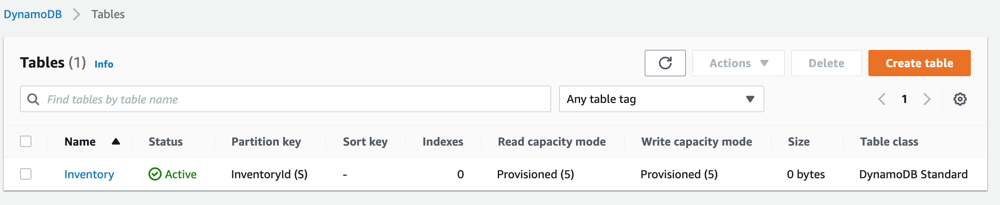

### Introducing - CloudFormation and DynamoDB


Using the following .yaml, as created a CloudFormation stack, using the default 

```
AWSTemplateFormatVersion: 2010-09-09
Description: CloudFormation Template To Create Alfredo's Inventory DynamoDB Table

Resources:
  InventoryTable:
    Type: AWS::DynamoDB::Table
    Properties:
      TableName: Inventory
      AttributeDefinitions:
        - 
          AttributeName: !Ref HashKeyElementName
          AttributeType: !Ref HashKeyElementType
      KeySchema:
        - 
          AttributeName: !Ref HashKeyElementName
          KeyType: HASH
          
      ProvisionedThroughput:
        ReadCapacityUnits: 5
        WriteCapacityUnits: 5 
        
Parameters:
  HashKeyElementName:
    Type: String
    Default: InventoryId
    Description: Hash Key Name
  HashKeyElementType:
    Type: String
    Default: S
    Description: Hash Key Type

Outputs:
  Inventory:
    Description: Alfredo's Inventory Table
    Value: !Ref InventoryTable
```


running

```
2022-05-19 16:23:00 UTC+0200	MyStack	CREATE_COMPLETE	-
2022-05-19 16:22:58 UTC+0200	InventoryTable	CREATE_COMPLETE	-
2022-05-19 16:22:27 UTC+0200	InventoryTable	CREATE_IN_PROGRESS	Resource creation Initiated
2022-05-19 16:22:26 UTC+0200	InventoryTable	CREATE_IN_PROGRESS	-
2022-05-19 16:22:20 UTC+0200	MyStack	CREATE_IN_PROGRESS	User Initiated
```


and finally under DynamoDB

