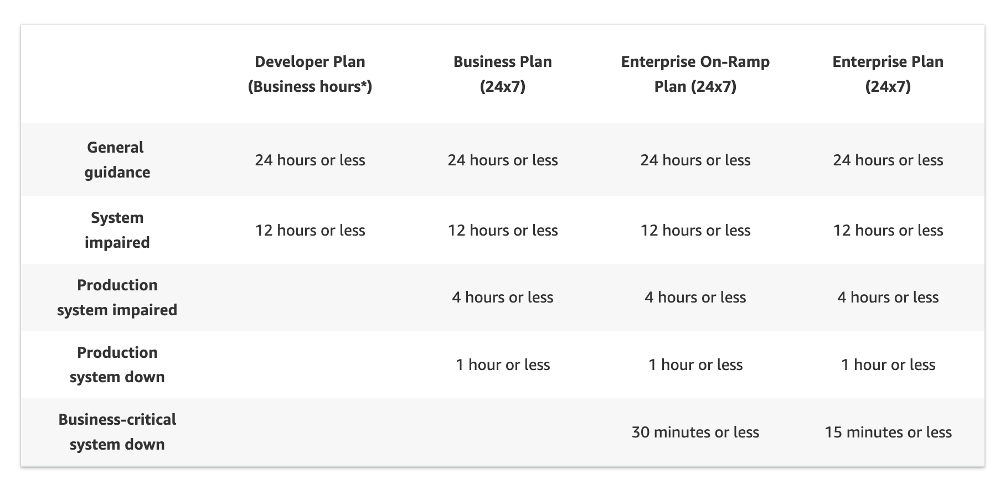
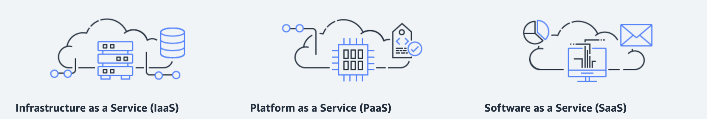
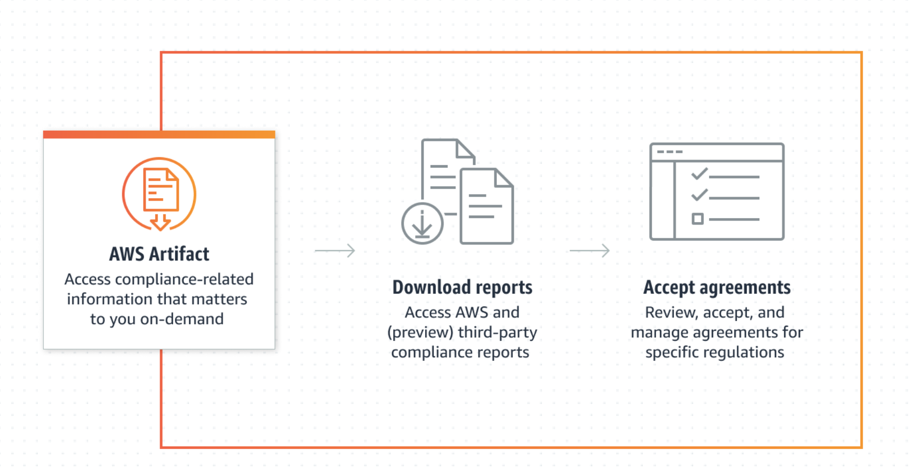
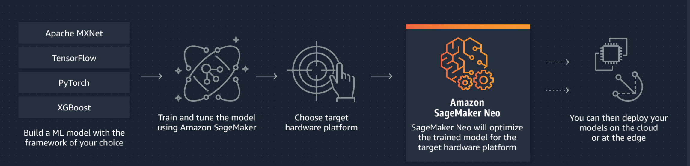
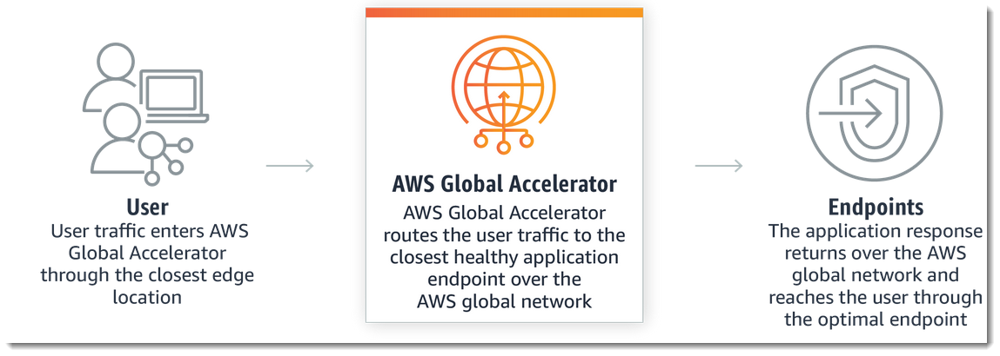
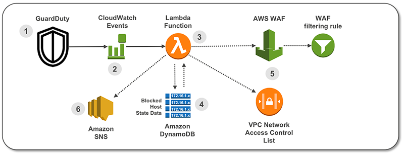

# exam-prep-notes

## Macie - security inventory for s3 

https://docs.aws.amazon.com/macie/latest/user/what-is-macie.html

> Macie automates the discovery of sensitive data, such as personally identifiable information (PII) and financial data, to provide you with a better understanding of the data that your organization stores in Amazon Simple Storage Service (Amazon S3). Macie also provides you with an inventory of your S3 buckets, and it automatically evaluates and monitors those buckets for security and access control. Within minutes, Macie can identify and report overly permissive or unencrypted buckets for your organization.


##  Trusted Advisor Recommendations - Cost - Perf - Security - Fault Tolerence - Service Limits

https://docs.aws.amazon.com/awssupport/latest/user/get-started-with-aws-trusted-advisor.html

> You can view the check descriptions and results for the following check categories:
* Cost optimization – Recommendations that can potentially save you money. These checks highlight unused resources and opportunities to reduce your bill.
* Performance – Recommendations that can improve the speed and responsiveness of your applications.
* Security – Recommendations for security settings that can make your AWS solution more secure.
* Fault tolerance – Recommendations that help increase the resiliency of your AWS solution. These checks highlight redundancy shortfalls, current service limits (also known as quotas), and overused resources.
* Service limits – Checks the usage for your account and whether your account approaches or exceeds the limit (also known as quotas) for AWS services and resources.

To view check categories: Sign in to the Trusted Advisor console at https://console.aws.amazon.com/trustedadvisor/home.


## AWS Pillars

> Operational Excellence Pillar

The operational excellence pillar focuses on running and monitoring systems, and continually improving processes and procedures. Key topics include automating changes, responding to events, and defining standards to manage daily operations.


> Security Pillar

The security pillar focuses on protecting information and systems. Key topics include confidentiality and integrity of data, managing user permissions, and establishing controls to detect security events.

> Reliability Pillar

The reliability pillar focuses on workloads performing their intended functions and how to recover quickly from failure to meet demands. Key topics include distributed system design, recovery planning, and adapting to changing requirements.

> Performance Efficiency Pillar

The performance efficiency pillar focuses on structured and streamlined allocation of IT and computing resources. Key topics include selecting resource types and sizes optimized for workload requirements, monitoring performance, and maintaining efficiency as business needs evolve.

> Cost Optimization Pillar

The cost optimization pillar focuses on avoiding unnecessary costs. Key topics include understanding spending over time and controlling fund allocation, selecting resources of the right type and quantity, and scaling to meet business needs without overspending.

> Sustainability Pillar

The sustainability pillar focuses on minimizing the environmental impacts of running cloud workloads. Key topics include a shared responsibility model for sustainability, understanding impact, and maximizing utilization to minimize required resources and reduce downstream impacts. 


##  What is AWS Shield?

https://aws.amazon.com/shield/faqs/


> AWS Shield is a managed service that provides protection against Distributed Denial of Service (DDoS) attacks for applications running on AWS. AWS Shield Standard is automatically enabled to all AWS customers at no additional cost. AWS Shield Advanced is an optional paid service. AWS Shield Advanced provides additional protections against more sophisticated and larger attacks for your applications running on Amazon Elastic Compute Cloud (EC2), Elastic Load Balancing (ELB), Amazon CloudFront, AWS Global Accelerator, and Route 53.


* What is AWS Shield Standard?
> AWS Shield Standard provides protection for all AWS customers against common and most frequently occurring infrastructure (layer 3 and 4) attacks like SYN/UDP floods, reflection attacks, and others to support high availability of your applications on AWS.

* Q. What is AWS Shield Advanced?

> AWS Shield Advanced provides enhanced protections for your applications running on protected Amazon EC2, Elastic Load Balancing (ELB), Amazon CloudFront, AWS Global Accelerator, and Route 53 resources against more sophisticated and larger attacks. AWS Shield Advanced protection provides always-on, flow-based monitoring of network traffic and active application monitoring to provide near real-time notifications of suspected DDoS incidents. AWS Shield Advanced also employs advanced attack mitigation and routing techniques for automatically mitigating attacks. Customers with Business or Enterprise support can also engage the Shield Response Team (SRT) 24x7 to manage and mitigate their application layer DDoS attacks. The DDoS cost protection for scaling protects your AWS bill against higher fees due to usage spikes from protected Amazon EC2, Elastic Load Balancing (ELB), Amazon CloudFront, AWS Global Accelerator, and Amazon Route 53 during a DDoS attack.


##  AWS Well-Architected Tool

> Q: What is the AWS Well-Architected Tool?

The AWS Well-Architected Tool lets you review your workloads against current AWS best practices and obtain advice on how to architect your workloads for the cloud. This tool uses the AWS Well-Architected Framework.

> Q: What are the pillars of the AWS Well-Architected Framework?

The general design principles and specific AWS best practices and guidance are organized into six conceptual areas. These conceptual areas are the pillars of the AWS Well-Architected Framework. These six pillars are 
1) operational excellence
2) security
3) reliability
4) performance efficiency
5) cost optimization
6) sustainability.

https://aws.amazon.com/well-architected-tool/faqs/

NB According tp ACG we need to know these Well-Architected Framework 6 pillar names verbatim ('in exactly the same words as were used originally.'):

>  "Performance Optimization is wrong: Performance Efficiency (not optimization) is a pillar in the Well-Architected Framework".


## Service Control Policies

> (SCPs)—An SCP defines the AWS service actions, such as Amazon EC2 RunInstances, that are available for use in different accounts within an organization. https://aws.amazon.com/organizations/faqs/

### SCP example for DenyAllOutsideEU

> This SCP denies access to any operations outside of the specified Regions.
https://docs.aws.amazon.com/organizations/latest/userguide/orgs_manage_policies_scps_examples_general.html
```
{
    "Version": "2012-10-17",
    "Statement": [
        {
            "Sid": "DenyAllOutsideEU",
            "Effect": "Deny",
            "NotAction": [
                "a4b:*",
                "acm:*",
                "aws-marketplace-management:*",
                "aws-marketplace:*",
                "aws-portal:*",
                "budgets:*",
                "ce:*",
                "chime:*",
                "cloudfront:*",
                "config:*",
                "cur:*",
                "directconnect:*",
                "ec2:DescribeRegions",
                "ec2:DescribeTransitGateways",
                "ec2:DescribeVpnGateways",
                "fms:*",
                "globalaccelerator:*",
                "health:*",
                "iam:*",
                "importexport:*",
                "kms:*",
                "mobileanalytics:*",
                "networkmanager:*",
                "organizations:*",
                "pricing:*",
                "route53:*",
                "route53domains:*",
                "s3:GetAccountPublic*",
                "s3:ListAllMyBuckets",
                "s3:PutAccountPublic*",
                "shield:*",
                "sts:*",
                "support:*",
                "trustedadvisor:*",
                "waf-regional:*",
                "waf:*",
                "wafv2:*",
                "wellarchitected:*"
            ],
            "Resource": "*",
            "Condition": {
                "StringNotEquals": {
                    "aws:RequestedRegion": [
                        "eu-central-1",
                        "eu-west-1"
                    ]
                },
                "ArnNotLike": {
                    "aws:PrincipalARN": [
                        "arn:aws:iam::*:role/Role1AllowedToBypassThisSCP",
                        "arn:aws:iam::*:role/Role2AllowedToBypassThisSCP"
                    ]
                }
            }
        }
    ]
}
```

## CloudTrail - auditing api calls and aws console activity (by region)

The concept of CloudTrail is fairly intuitive, I've used it a few times but it wasn't obvious to me this was region specific tracking 

> Q: What is AWS CloudTrail?
CloudTrail enables auditing, security monitoring, and operational troubleshooting by *tracking user activity and API usage*. CloudTrail logs, continuously monitors, and retains account activity related to actions across your AWS infrastructure, giving you control over storage, analysis, and remediation actions.

> Q: What are the benefits of CloudTrail?
CloudTrail helps you prove compliance, improve security posture, and *consolidate activity records across Regions and accounts*. 
https://aws.amazon.com/cloudtrail/faqs/


## AWS Direct Connect vs AWS Site-to-Site VPN

Notice the high speed connections "1 Gbps, 10 Gbps, or 100 Gbps Ethernet port dedicated to a single customer" and improved reliability for Direct Connect 

### AWS Direct Connect
https://aws.amazon.com/directconnect/faqs/

Q: What is AWS Direct Connect?

AWS Direct Connect is a networking service that provides an alternative to using the internet to connect to AWS. Using AWS Direct Connect, data that would have previously been transported over the internet is delivered through a private network connection between your facilities and AWS. In many circumstances, private network connections can reduce costs, increase bandwidth, and provide a more consistent network experience than internet-based connections. All AWS services, including Amazon Elastic Compute Cloud (EC2), Amazon Virtual Private Cloud (VPC), Amazon Simple Storage Service (S3), and Amazon DynamoDB can be used with AWS Direct Connect.

Q: Where is AWS Direct Connect available?
A complete list of AWS Direct Connect locations is available on the AWS Direct Connect locations page. When using AWS Direct Connect, you can connect to VPCs deployed in any AWS Region and Availability Zone. You can also connect to AWS Local Zones.

Q: What is the difference between dedicated and hosted connections?

A dedicated connection is made through a 1 Gbps, 10 Gbps, or 100 Gbps Ethernet port dedicated to a single customer. Hosted connections are sourced from a AWS Direct Connect Partner that has a network link between themselves and AWS. 


### AWS Site-to-Site VPN

https://docs.aws.amazon.com/vpn/latest/s2svpn/VPC_VPN.html

A dedicated connection is made through a 1 Gbps, 10 Gbps, or 100 Gbps Ethernet port dedicated to a single customer. Hosted connections are sourced from a AWS Direct Connect Partner that has a network link between themselves and AWS. 


By default, instances that you launch into an Amazon VPC can't communicate with your own (remote) network. You can enable access to your remote network from your VPC by creating an AWS Site-to-Site VPN (Site-to-Site VPN) connection, and configuring routing to pass traffic through the connection.


## VPC Key details

> Q. What are the components of Amazon VPC?
```
Amazon VPC comprises a variety of objects that will be familiar to customers with existing networks:
A Virtual Private Cloud: A logically isolated virtual network in the AWS cloud. You define a VPC’s IP address space from ranges you select.
Subnet: A segment of a VPC’s IP address range where you can place groups of isolated resources.
Internet Gateway: The Amazon VPC side of a connection to the public Internet.
NAT Gateway: A highly available, managed Network Address Translation (NAT) service for your resources in a private subnet to access the Internet.
Virtual private gateway: The Amazon VPC side of a VPN connection.
Peering Connection: A peering connection enables you to route traffic via private IP addresses between two peered VPCs.
VPC Endpoints: Enables private connectivity to services hosted in AWS, from within your VPC without using an Internet Gateway, VPN, Network Address Translation (NAT) devices, or firewall proxies.
Egress-only Internet Gateway: A stateful gateway to provide egress only access for IPv6 traffic from the VPC to the Internet.
```


> Q. How do I get started with Amazon VPC?
```
Your AWS resources are automatically provisioned in a ready-to-use default VPC. You can choose to create additional VPCs by going to the Amazon VPC page in the AWS Management Console and selecting "Start VPC Wizard".
You’ll be presented with four basic options for network architectures. After selecting an option, you can modify the size and IP address range of the VPC and its subnets. If you select an option with Hardware VPN Access, you will need to specify the IP address of the VPN hardware on your network. You can modify the VPC to add or remove secondary IP ranges and gateways, or add more subnets to IP ranges.
The four options are:
Amazon VPC with a single public subnet only
Amazon VPC with public and private subnets
Amazon VPC with public and private subnets and AWS Site-to-Site VPN access
Amazon VPC with a private subnet only and AWS Site-to-Site VPN access
```

## AWS Support questions and levels

https://aws.amazon.com/premiumsupport/faqs/

> Q: What types of issues are supported?
```
Your AWS Support covers development and production issues for AWS products and services, along with other key stack components.
"How to" questions about AWS service and features
Best practices to help you successfully integrate, deploy, and manage applications in the cloud
Troubleshooting API and AWS SDK issues
Troubleshooting operational or systemic problems with AWS resources
Issues with our Management Console or other AWS tools
Problems detected by Health Checks
A number of third-party applications such as OS, web servers, email, databases, and storage configuration

AWS Support does not include:
Code development
Debugging custom software
Performing system administration tasks
```




## AWS Control Tower

https://aws.amazon.com/controltower/faqs/

> Q: What is AWS Control Tower?
```
AWS Control Tower offers the easiest way to set up and govern a secure, multi-account AWS environment. 
It establishes a landing zone that is based on best-practices blueprints, 
and it enables governance using guardrails you can choose from a pre-packaged list. 
The landing zone is a well-architected, multi-account baseline that follows AWS best practices. 
Guardrails implement governance rules for security, compliance, and operations.
```

> Q: Who should use AWS Control Tower?
```
If you want to create or manage your multi-account AWS environment with best practices, use AWS Control Tower.
It offers prescriptive guidance to govern your AWS environment at scale. 
It gives you control over your environment without sacrificing the speed and agility AWS provides for builders. 
```


> Q: How is AWS Control Tower different from the AWS Landing Zone solution?
```
AWS Control Tower is an AWS native service providing a pre-defined set of blueprints and 
guardrails to help you implement a landing zone for AWS accounts. AWS Landing Zone is an 
AWS solution offered through AWS Solution Architect, Professional Services, or AWS Partner 
Network (APN) Partners that provides a fully configurable, customer-managed landing zone 
implementation. 
```

> Q: How is AWS Control Tower different from AWS Security Hub?
```
AWS Control Tower and AWS Security Hub are complementary services. AWS Security Hub is 
used by security teams, compliance professionals, and DevOps engineers to continuously 
monitor and improve the security posture of their AWS accounts and resources. Besides 
aggregating security findings and enabling automated remediation, AWS Security Hub also 
performs security best practice checks against the AWS Foundational Security Best Practices 
standard and other industry and regulatory standards. 
```

> Q: How does AWS Control Tower interoperate with AWS Service Catalog?
```
AWS Control Tower automatically sets up AWS Service Catalog as the underlying AWS service 
to enable provisioning of new accounts through an account factory. While AWS Control Tower 
provides central governance at an account level, AWS Service Catalog can further provide 
granular governance at a resource level. AWS Service Catalog also lets you provision 
infrastructure and application stacks that have been pre-approved by IT for use inside your accounts.
```

> Q: How does AWS Control Tower interoperate with AWS Systems Manager?
```
You can use AWS Control Tower to set up and govern your AWS environment, and then use AWS 
Systems Manager to handle its ongoing day to day operations. AWS Systems Manager provides 
a unified user interface so you can view operational data from multiple AWS services and 
automate operational tasks across your AWS resources. 
```


## Amazon Support: Web Services Concierge, TAM and API

> https://www.amazonaws.cn/en/support/features/

> Your Amazon Web Services Concierge is a senior customer service agent who is assigned to your account when you subscribe to an Enterprise or qualified Reseller Support plan. This Concierge agent is your primary point of contact for billing or account inquiries; when you don’t know whom to call, they will find the right people to help. In most cases, the Amazon Web Services Concierge is available during regular business hours in your headquarters’ geography. The best way to contact the Amazon Web Services Concierge is through the  Amazon Web Services Support Center.

> Here are some of the questions that you might ask your Amazon Web Services Concierge:
```
How is my monthly bill calculated?
How can I optimize costs?
How can I restructure my consolidated bill?
How can I locate the service limits for my accounts?
How can I identify underutilized resources?
How can I manage multiple linked accounts on a consolidated bill?
How can I make a bulk Reserved Instances purchase?
My company has merged with another company. How do I transition the Amazon Web Services accounts to the new company?
```

> Amazon Web Services Support API

The Amazon Web Services Support API allows you to programmatically interact with your Support cases (create, edit, close) and access/refresh Trusted Advisor best practices recommendations. For more information, see the Amazon Web Services  Support Documentation.


> Technical Account Manager (TAM)

For Enterprise-level customers, a TAM provides technical expertise for the full range of Amazon Web Services services and obtains a detailed understanding of your use case and technology architecture. TAMs work with Amazon Web Services Solution Architects to help you launch new projects and give best practices recommendations throughout the implementation life cycle. Your TAM is the primary point of contact for ongoing support needs, and you have a direct telephone line to your TAM.


## AWS Shared Responsibility Model 

Mostly common sense (context is key, if you run Postgres on EC2 then you control much more than RDS-Postgres) but good to familarize oneself with this diagram:

https://aws.amazon.com/compliance/shared-responsibility-model/


## AWS types-of-cloud-computing

Love this graphic:



https://aws.amazon.com/types-of-cloud-computing/


* Infrastructure as a Service (IaaS)

>Infrastructure as a Service, sometimes abbreviated as IaaS, contains the basic building blocks for cloud IT and typically provide access to networking features, computers (virtual or on dedicated hardware), and data storage space. Infrastructure as a Service provides you with the highest level of flexibility and management control over your IT resources and is most similar to existing IT resources that many IT departments and developers are familiar with today.

* Platform as a Service (PaaS)

> Platforms as a service remove the need for organizations to manage the underlying infrastructure (usually hardware and operating systems) and allow you to focus on the deployment and management of your applications. This helps you be more efficient as you don’t need to worry about resource procurement, capacity planning, software maintenance, patching, or any of the other undifferentiated heavy lifting involved in running your application.


* Software as a Service (SaaS)

> Software as a Service provides you with a completed product that is run and managed by the service provider. In most cases, people referring to Software as a Service are referring to end-user applications. With a SaaS offering you do not have to think about how the service is maintained or how the underlying infrastructure is managed; you only need to think about how you will use that particular piece of software. A common example of a SaaS application is web-based email where you can send and receive email without having to manage feature additions to the email product or maintaining the servers and operating systems that the email program is running on.

## AWS ARTIFACT?

Another great graphic, gives a really good sense of what this product does and basic functionality:


https://aws.amazon.com/artifact/faq/

* 1. WHAT IS AWS ARTIFACT?
>  AWS Artifact, available in the console, is a self-service audit artifact retrieval portal that provides our customers with on-demand access to AWS’ compliance documentation and AWS agreements. You can use AWS Artifact Reports to download AWS security and compliance documents, such as AWS ISO certifications, Payment Card Industry (PCI), and System and Organization Control (SOC) reports.
You can use AWS Artifact Agreements to review, accept, and track the status of AWS agreements such as the Business Associate Addendum (BAA).

* 2. WHO HAS ACCESS TO AWS ARTIFACT?
> All AWS Accounts have access to AWS Artifact. Root users and IAM users with admin permissions can download all audit artifacts available to their account by agreeing to the associated terms and conditions.


## Amazon SageMaker (Neo)



https://aws.amazon.com/sagemaker/neo/

> Amazon SageMaker Neo enables developers to optimize machine learning (ML) models for inference on SageMaker in the cloud and supported devices at the edge. ML inference is the process of using a trained machine learning model to make predictions. After training a model for high accuracy, developers often spend a lot of time and effort tuning the model for high performance. For inference in the cloud, developers often turn to large instances with lots of memory and powerful processing capabilities at higher costs to achieve better throughput. For inference on edge devices with limited compute and memory, developers often spend months hand-tuning the model to achieve acceptable performance within the device hardware constraints.


## AWS Global Accelerator

https://aws.amazon.com/global-accelerator/faqs/



* Q: What is AWS Global Accelerator?

> A: AWS Global Accelerator is a networking service that helps you improve the availability and performance of the applications that you offer to your global users. AWS Global Accelerator is easy to set up, configure, and manage. It provides static IP addresses that provide a fixed entry point to your applications and eliminate the complexity of managing specific IP addresses for different AWS Regions and Availability Zones. AWS Global Accelerator always routes user traffic to the optimal endpoint based on performance, reacting instantly to changes in application health, your user’s location, and policies that you configure. You can test the performance benefits from your location with a speed comparison tool. Like other AWS services, AWS Global Accelerator is a self-service, pay-per-use offering, requiring no long term commitments or minimum fees.

* Q: What can I do with AWS Global Accelerator?

> A: By using AWS Global Accelerator, you can:
(1) Associate the static IP addresses provided by AWS Global Accelerator to regional AWS resources or endpoints, such as Network Load Balancers, Application Load Balancers, EC2 Instances, and Elastic IP addresses. The IP addresses are anycast from AWS edge locations so they provide onboarding to the AWS global network close to your users.
(2) Easily move endpoints between Availability Zones or AWS Regions without needing to update your DNS configuration or change client-facing applications.
(3) Dial traffic up or down for a specific AWS Region by configuring a traffic dial percentage for your endpoint groups. This is especially useful for testing performance and releasing updates.
Control the proportion of traffic directed to each endpoint within an endpoint group by assigning weights across the endpoints.


## GuardDuty WAF




> Amazon GuardDuty is a threat detection service that continuously monitors your AWS accounts and workloads for malicious activity and delivers detailed security findings for visibility and remediation.


Here’s how the solution works, as shown in the diagram:
* A GuardDuty finding is raised with suspected malicious activity.
* A CloudWatch Event is configured to filter for GuardDuty Finding type.
* A Lambda function is invoked by the CloudWatch Event and parses the GuardDuty finding.
* State data for blocked hosts is stored in Amazon DynamoDB table. The Lambda function checks the state table for existing host entry.
* The Lambda function creates a Rule inside AWS WAF and in a VPC NACL.
* A notification email is sent via Amazon Simple Notification Service (SNS).