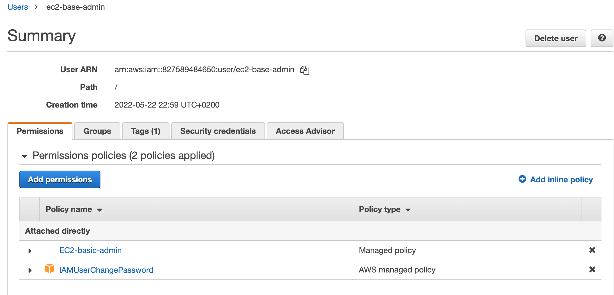

## IAM setup for EC2 basic CLI admin 

### Step 01 - IAM > Create Policy ""EC2-basic-admin"

Note I created this JSON via the GUI which is quite fiddly as there are  100s of options/checkboxes to choose between... but the final json output is quite readable:

```
arn:aws:iam::827589484650:policy/EC2-basic-admin

{
    "Version": "2012-10-17",
    "Statement": [
        {
            "Sid": "VisualEditor0",
            "Effect": "Allow",
            "Action": [
                "ec2:StartInstances",
                "ec2:StopInstances"
            ],
            "Resource": "arn:aws:ec2:*:827589484650:instance/*",
            "Condition": {
                "BoolIfExists": {
                    "aws:MultiFactorAuthPresent": "true"
                }
            }
        },
        {
            "Sid": "VisualEditor1",
            "Effect": "Allow",
            "Action": [
                "ec2:DescribeInstances",
                "ec2:DescribeInstanceTypes",
                "ec2:DescribeInstanceStatus"
            ],
            "Resource": "*",
            "Condition": {
                "BoolIfExists": {
                    "aws:MultiFactorAuthPresent": "true"
                }
            }
        }
    ]
}
```


### Step 02 - IAM > Create User ""EC2-basic-admin"

When I created the user, it get allocated `IAMUserChangePassword` by default (you can deselect this) plus I gave my custom policy `EC2-basic-admin`




### Step 03 - CLI config (quickstart)

Following [aws cli-configure-quickstart doco](https://docs.aws.amazon.com/cli/latest/userguide/cli-configure-quickstart.html)


```
~/projects/CLF-C01_AWS-Certified-Cloud-Practitioner_notes_and_scripts $ aws configure
AWS Access Key ID [None]: AKIA...................
AWS Secret Access Key [None]: i+Hw7Y..............................
Default region name [None]: us-east-1
Default output format [None]: json
```

and in my home directory there is a `.aws` directory with `credentials` and `config` details (do not upload these to github!)
```
~/projects/CLF-C01_AWS-Certified-Cloud-Practitioner_notes_and_scripts $ ls -ltr ~/.aws/c*
-rw-------  1 dave  staff  116 May 22 23:01 /Users/dave/.aws/credentials
-rw-------  1 dave  staff   43 May 22 23:01 /Users/dave/.aws/config
```

### Step 04 - test CLI access by running "ec2 describe-instances"

i.e. test via simple `aws ec2 describe-instances` cli command

```
~/projects/CLF-C01_AWS-Certified-Cloud-Practitioner_notes_and_scripts $ aws ec2 describe-instances
{
    "Reservations": [
        {
            "Instances": [
                {
                    "Monitoring": {
                        "State": "disabled"
                    },
                    "PublicDnsName": "",
                    "StateReason": {
                        "Message": "Client.UserInitiatedShutdown: User initiated shutdown",
                        "Code": "Client.UserInitiatedShutdown"
                    },
                    "State": {
                        "Code": 80,
                        "Name": "stopped"
                    },
                    "EbsOptimized": false,
                    "LaunchTime": "2022-05-16T20:18:14.000Z",
                    "PrivateIpAddress": "10.0.0.70",
                    "ProductCodes": [],
                    "VpcId": "vpc-08663e4a5bb11317a",
                    "CpuOptions": {
                        "CoreCount": 1,
                        "ThreadsPerCore": 1
                    },
                    "StateTransitionReason": "User initiated (2022-05-16 20:20:42 GMT)",
                    "InstanceId": "i-0f4b5b1ab299e960e",
...                    
```                   