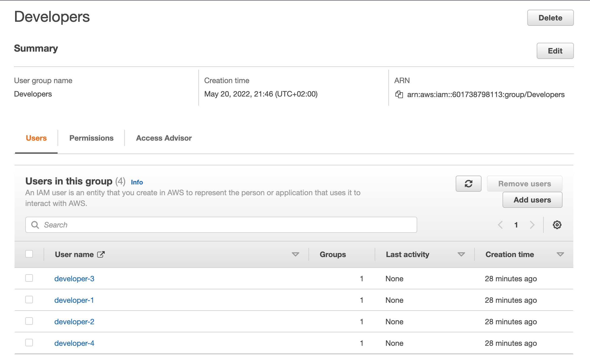

## Intro to IAM with a Custom Policy, User Group and User Assignment 

## Step 01 setup Custom Policy "customLambdaDevAccess"

IAM >> Policies >> Create policy.
Note this AWS Lamba all (AWSLambda_FullAccess) but with EC2 removed:

```
{
    "Version": "2012-10-17",
    "Statement": [
        {
            "Sid": "VisualEditor0",
            "Effect": "Allow",
            "Action": "iam:PassRole",
            "Resource": "*",
            "Condition": {
                "StringEquals": {
                    "iam:PassedToService": "lambda.amazonaws.com"
                }
            }
        },
        {
            "Sid": "VisualEditor1",
            "Effect": "Allow",
            "Action": [
                "iam:GetRole",
                "iam:GetPolicyVersion",
                "states:ListStateMachines",
                "tag:GetResources",
                "iam:GetPolicy",
                "states:DescribeStateMachine",
                "logs:DescribeLogGroups",
                "cloudwatch:GetMetricData",
                "iam:ListRoles",
                "cloudwatch:ListMetrics",
                "cloudformation:DescribeStacks",
                "xray:BatchGetTraces",
                "iam:ListAttachedRolePolicies",
                "kms:ListAliases",
                "lambda:*",
                "iam:ListRolePolicies",
                "iam:GetRolePolicy",
                "xray:GetTraceSummaries",
                "cloudformation:ListStackResources"
            ],
            "Resource": "*"
        },
        {
            "Sid": "VisualEditor2",
            "Effect": "Allow",
            "Action": [
                "logs:DescribeLogStreams",
                "logs:GetLogEvents",
                "logs:FilterLogEvents"
            ],
            "Resource": "arn:aws:logs:*:*:log-group:/aws/lambda/*"
        }
    ]
}
```

## Step 02 create DeveloperGroup with customLambdaDevAccess

We did this assignment within IAM >> User groups >> Create group i.e. while creating DeveloperGroup

## Step 03 add users (technically this could have also been done within step02)

IAM >> User groups >> Add users

and finally add users to our DeveloperGroup wit CustomPermissions

