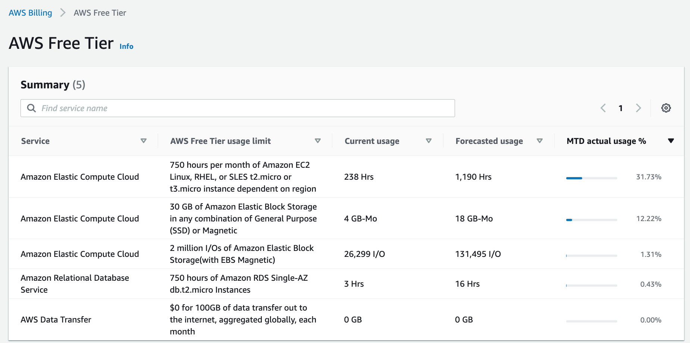

## Debug surprising Aug 2022 bill - terraform oregon gotcha

Given I have scripts 
* to monitor my EC2 and RDS usage 
* these are free-tier services 
* I have scripts to check the status and shutdown i.e. they only be up for a tiny fraction of the month

it was a bit of a surpise to received a 12 euro bill, for Aug 2022 processing.

###Checking the "AWS Free Tier" metrics one week in September I see suprisingly high EC2 usage

### Reviewng the last Monthly bill , which is broken down by region

### Checking oregon 
Finally I can the issue, I was following a terraform course and while I was proactively checking usage metrics in Virgina (us-east-1), the terraform was using Oregon (us-west-2), so I've shut these down manually: 

### Need to update my terraform course scripts
I'll also tweak my terraform course scripts to also *only* use us-east-1

